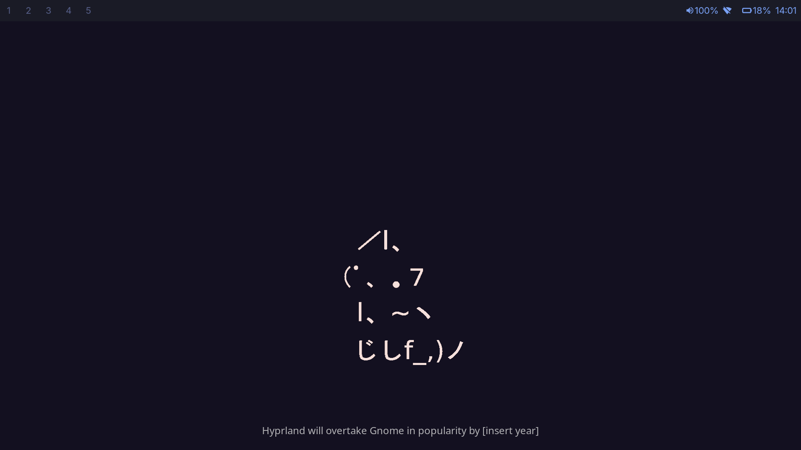

# My Config

Arch Linux dotfiles for Hyprland with Tokyo Night theme.



## Included

- **WM**: Hyprland (keybinds, gestures, idle, lock, wallpaper)
- **Bar**: Waybar (workspaces, audio, network, battery, clock)
- **Launcher**: Wofi
- **Terminals**: Kitty, Alacritty
- **Shell**: Zsh (Powerlevel10k, zoxide, fzf)
- **System Info**: Fastfetch

> **Note:** You can run any script with `bash script.sh` — no need to `chmod` unless you prefer `./script.sh`.

## Quick Start (Fresh Install)

**From Arch ISO → arch-chroot:**

```bash
pacman -S --noconfirm git
git clone https://github.com/Momokh99/My-config /root/My-config
cd /root/My-config
bash install_pack.sh
```

**After reboot (as normal user):**

```bash
cd ~/My-config
bash change_Shell.sh       # Set Zsh as default — log out then back in
bash install_conf.sh       # Deploy configs to ~/.config/
```

## Scripts

| Script | What it does | Usage |
|---|---|---|
| `install_pack.sh` | Updates system, installs pacman & AUR packages | `sudo bash install_pack.sh` (normal user) or `bash install_pack.sh` (root/chroot) |
| `change_Shell.sh` | Installs Zsh if missing, sets it as default via `chsh` | `bash change_Shell.sh` — then log out & back in |
| `install_conf.sh` | Copies configs from `~/My-config/` to `~/.config/` | `bash install_conf.sh` |
| `backup.sh` | Saves current configs & dotfiles to `~/config/config<date>/` | `bash backup.sh` |

## Keybinds (SUPER = Windows/Mod4)

| Key | Action |
|---|---|
| SUPER + Return | Terminal (kitty) |
| SUPER + E | File manager (dolphin) |
| SUPER + space | App launcher (wofi) |
| SUPER + Z | Zen Browser |
| SUPER + F | Firefox |
| SUPER + N | Editor (kitty + nvim) |
| SUPER + O | Editor (kitty + opencode) |
| SUPER + I | WiFi (kitty + impala) |
| SUPER + W | Kill active window |
| SUPER + SHIFT + Q | Exit Hyprland |
| SUPER + SHIFT + E | Power menu (wlogout) |
| SUPER + SHIFT + L | Lock screen |
| SUPER + SHIFT + R | Reload Hyprland |
| SUPER + B | Toggle browser special workspace |
| SUPER + SHIFT + B | Move window to browser workspace |
| SUPER + left/right/up/down | Move focus |
| SUPER + J | Toggle split |
| SUPER + P | Pseudo-tiling |
| ALT + F | Fullscreen |
| ALT + V | Toggle floating |
| ALT + &/é/"/'/(-/_/è/ç | Switch workspace 1-9 (AZERTY) |
| ALT + SHIFT + &/é/"/'/(-/_/è/ç | Move window to workspace 1-9 (AZERTY) |
| Print | Screenshot full |
| SUPER + Print | Screenshot region |
| SUPER + SHIFT + S | Screenshot to file |

## Theme

Tokyo Night — dark background (`#1a1b26`), blue accent (`#7aa2f7`), JetBrainsMono Nerd Font.
